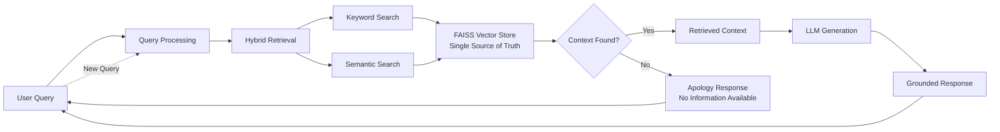
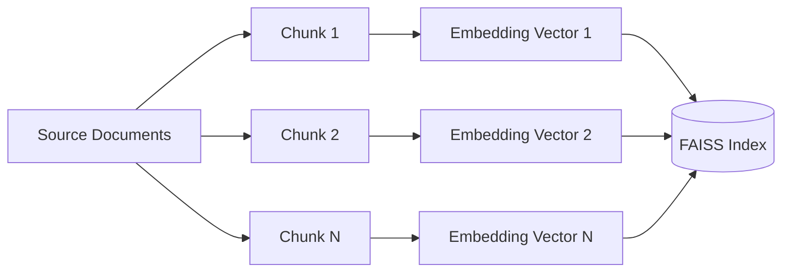

# Rag Chatbot

***[For Frontend Click Here](https://github.com/hariom2809/Rag-Chatbot-Frontend.git)***

## Overview:

Rag chatbot: It is a Ai powered chatbot which answers the user query only on hte basis of the Data provided to it .  The reason why RAG is that it minimize the halosination of AI chatbots we have now as they also hav ethe RAG integrated in them .  This project was made during my internship at that time the tools were not so developed. So this project might be not working at the time you will see reading this . You can take the help of any LLM model to debug and run it on your locally . Remember if you dont have nay GPU powered System so don't use any powerful model instead use any light weight model whcih can give you the basic working of it .

## Features:

- [x] API Calling
- [x] Context Retrieval
- [x] Response Chaining
- [x] System Prompt
- [x] Vector Embeddings
- [x] Query Response on the basis of provided Data

## Tech Stack:

- *Language* :  **Python**
- *Framework/Library* :  **FastAPI**

## High Level Design



## Knowledge Base Structure

The system stores information in a FAISS vector store. Documents are split into chunks, converted into embeddings, and indexed for retrieval.



**Note:** The FAISS index is the single source of truth for retrieval. If relevant context is not found in the vector store, the system returns an apology response instead of generating an answer.

## Project Structure:

```text
Rag-Chatbot-Backend
|
|-- .venv/
|-- app/
|   |
|   |-- config.py
|   |-- ingest.py
|   |-- main.py
|   |-- rag.py
|
|-- data/
|   |
|   |-- document.pdf
|
|-- vectorstore/
|   |
|   |
|   |-- index.faiss
|   |-- index.pkl
|   
|-- .env
|-- .gitignore
|-- README.ms
|-- requirements.txt
```

## Installation:

```bash
git clone https://github.com/hariom2809/Rag-Chatbot-Backend.git
cd Rag-Chatbot-Backend
```

```bash
python3 -m venv .venv
```

```bash
source .venv/bin/activate
```

```bash
pip3 install -r requirements.txt
```

```bash
uvicorn app.main:app 
```
## Learnings:

- **Langchain**
- **RAG working**
- **System building**
- **Response optimisation**
- **Toke Embeddings**
- **FastAPI**

## Author:

***Hariom Gupta***
- Linkedin: [linkedin/hariom2809](https://www.linkedin.com/in/hariom2809/)